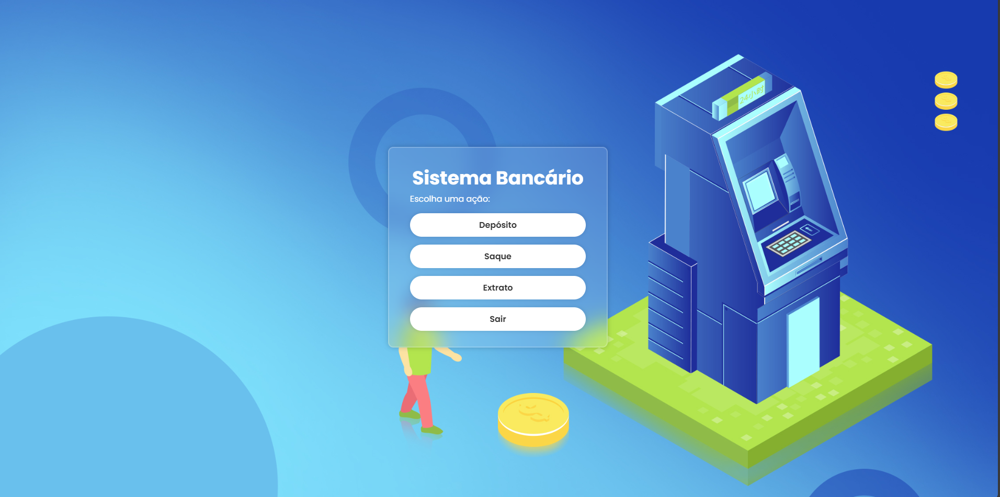

zzzzzzzzzzzzzzzzzzzzzzzzzzzzzzzzzzzzzzzzzzzzzzzzzzzzzzzzzzzzzzzzzzzzzzzzzzzzzzzzzzzzzzzzzzzzzzzzzzzzzzzzzzzzzzzzzzzzzzzzzzzzzzzzzzzzzzzzzzzzzzzzzzzzzzzzzzzz# 📌 Sistema Bancário

Uma Aplicação web desenvolvida para simular operações básicas de um banco, como criação de contas, depósitos, saques e consultas de saldo. Com um sistema de login e registro simples.

---

## 🚀 Tecnologias usadas  
- HTML, CSS, JavaScript  

---

## 📷 Demonstração  

### Tela inicial  
 

### Tela de Registro

### Tela do Sistema

